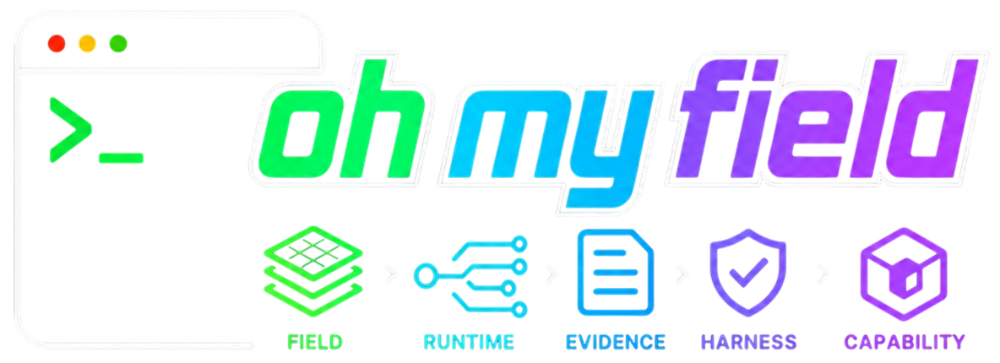

<p align="center">
  
</p>

# oh-my-field

[](https://github.com/Baekpica/oh-my-field/actions/workflows/ci.yml)

Field-fit agents to real work. oh-my-field turns one-off agent sessions into
portable, evidence-backed capability packages.

OMF is not an agent runtime. Codex, Claude Code, Hermes, or another agent does
the work. OMF imports that run, preserves the evidence, and promotes repeatable
work into a package that can be reviewed, hardened, and exported.

## Why OMF

Most agent tools help you run the next prompt. OMF focuses on what happens after
an agent does useful work.

- Agent work should compound instead of disappearing into chat history.
- A good run should leave behind evidence, context, checks, and review signals.
- Repeated work should become a repo-local package, not another hand-written
  prompt.
- The package should move across models, coding agents, projects, and operating
  environments.
- Users should review and accept changes; they should not need to write every
  rule by hand.

The product goal is simple: turn "the agent did this once" into "this team can
reuse and verify this capability again."

## Core Concepts

### Field

The working environment where the task actually happens: a codebase,
infrastructure environment, internal process, data pipeline, support workflow,
or reporting system. A field includes local constraints, preferences, failure
history, and the quality bar for real work.

### Capability

A capability is a repo-local package that contains:

1. An agent instruction surface.
2. Context selection policy.
3. Verification harness.
4. Source evidence links.
5. Regression and eval cases.
6. Accepted learning patches.
7. Integrity metadata.

It is not an agent runtime. It can be exported into runtime-specific forms such
as Codex instructions, Claude Code project memory, Hermes profile assets, or a
generic skill bundle.

### Evidence

Structured records from agent work: run logs, prompts, context files, command
outputs, diffs, test results, artifacts, user feedback, retries, and improvement
notes. Failed runs are useful evidence too.

### Harness

The checks used to decide whether a result is acceptable. For code work this is
usually tests, lint, type checks, or smoke commands. For operational or document
work it can be checklists, rubrics, schema validation, or human approval.

## Install

Recommended persistent CLI install:

```bash
pipx install oh-my-field
omf --help
```

Try without a persistent install:

```bash
uvx oh-my-field --help
```

Development install from source:

```bash
git clone https://github.com/Baekpica/oh-my-field.git
cd oh-my-field
uv sync --all-extras --dev
uv run omf --help
```

Development checks:

```bash
uv run ruff format --check .
uv run ruff check .
uv run pyright
uv run pytest
```

## Quick Start

The first product loop is three commands: import an external agent run, promote
the evidence into a package, then inspect capability health.

```bash
mkdir -p /tmp/omf-smoke
printf "agent run log\n" > /tmp/omf-smoke/codex.log
printf "pytest passed\n" > /tmp/omf-smoke/pytest.txt

omf import-run codex \
  --log /tmp/omf-smoke/codex.log \
  --goal "triage repo issue" \
  --test-result /tmp/omf-smoke/pytest.txt \
  --evidence-dir /tmp/omf-smoke/evidence \
  --outcome success

omf promote <evidence_id> \
  --name repo_issue_triage \
  --description "Repository issue triage capability" \
  --evidence-dir /tmp/omf-smoke/evidence \
  --capabilities-dir /tmp/omf-smoke/capabilities

omf health repo_issue_triage \
  --capabilities-dir /tmp/omf-smoke/capabilities
```

From a source checkout, prefix those commands with `uv run`. Use a real agent
log when you have one.

## What You Get

`promote` creates a package under `capabilities/<name>/`:

- `capability.yaml`: canonical metadata and provenance.
- `instructions.md`: runtime-neutral agent instructions.
- `harness.yaml`: verification and approval boundaries.
- `README.md`: a human-readable capability card.

The package is the source of truth. Runtime-specific files such as Codex
instructions, Claude Code memory, Hermes profile assets, or generic skill
bundles are export targets.

## Portability Lifecycle

A capability moves across runtimes through four distinct states. Keep them
separate — "can be exported" is not the same as "works on the target":

- **Exported**: the capability has been converted into a target runtime
  bundle (`omf capability export`).
- **Imported**: the bundle has been materialized in a target project
  (`omf capability import`).
- **Validated**: an actual target run has passed under the recorded target
  runtime/model/project (`omf capability validate --run-command ...`). Static
  `import --validate` checks alone leave the import at `needs_validation`;
  without a `--run-command`, validate records `manual_run_required` and the
  expected artifacts to bring back via `import-run`.
- **Portable**: the capability has at least one validated target import.

`omf health` reports `export_status`, `import_status`, and
`validation_status` separately so these never get conflated, and lists each
imported target with its own status.

### Cross-runtime example: Codex/gpt-5.5 → Hermes/qwen3.6-27B

```bash
# Source project: Codex / gpt-5.5 / xhigh
uv run omf import-run codex \
  --log .agent/codex.log \
  --goal "triage repo issue" \
  --test-result .agent/pytest.txt \
  --artifact-root .agent/artifacts \
  --model gpt-5.5

uv run omf promote <evidence_id> \
  --name repo_issue_triage \
  --description "Repository issue triage capability"

uv run omf capability export repo_issue_triage \
  --target hermes \
  --target-model qwen3.6-27b \
  --source-reasoning-effort xhigh \
  --source-context-tokens 64000 \
  --target-context-tokens 16000 \
  --include-evidence redacted \
  --out .omf/exports/repo_issue_triage-hermes-qwen36

# Target project: Hermes / qwen3.6-27B
uv run omf capability import .omf/exports/repo_issue_triage-hermes-qwen36 \
  --runtime hermes \
  --model qwen3.6-27b \
  --project target-repo \
  --available-tool file_system \
  --validate

# Re-validate with an actual target run (or omit --run-command to record a
# manual run); OMF gates the command behind --approve-command-risk and folds
# the exit code into the target eval.
uv run omf capability validate repo_issue_triage \
  --target hermes \
  --model qwen3.6-27b \
  --available-tool file_system \
  --run-command "hermes-code --profile target --skill repo_issue_triage" \
  --approve-command-risk
```

The export records the bundle under the source package's `exports/`, and the
import writes a target overlay under
`capabilities/repo_issue_triage/imports/hermes-qwen3.6-27b/`. Using
`--include-evidence redacted` carries content-stripped source evidence so the
target project can verify capability lineage offline.

## Safety Model

OMF records command intent and risk. Commands classified as write, destructive,
external, credential, production, or paid risk are recorded but not executed
unless the command receives explicit approval.

Use `--approve-command-risk` only when you intentionally want a risky command to
execute. Command strings are legacy shell strings, so treat `--command`,
`--harness-command`, and `--run-command` as shell execution surfaces. OMF records
the cwd, risk categories, approval state, shell mode, and environment policy for
each command execution.

Commands run with a minimal environment by default. OMF keeps `PATH`, `HOME`,
and `TMPDIR`, blocks common secret-bearing variables such as `OPENAI_API_KEY`,
`ANTHROPIC_API_KEY`, `AWS_SECRET_ACCESS_KEY`, and `GITHUB_TOKEN`, and records
blocked variable names in the execution record. Pass a variable explicitly with
`--allow-env NAME` only when the command needs it. Export bundles are also gated
by explicit approval.

Artifact root import also applies safety limits. `import-run --artifact-root`
skips `.git/`, `.venv/`, `node_modules/`, `.env*`, private key patterns, and
symlinked files by default. Use `.omfignore` or `--exclude PATTERN` for
project-specific exclusions, and cap traversal with `--max-artifact-count` and
`--max-total-artifact-bytes`. Binary or oversized artifacts remain
metadata-only.

## Learn More

- Full product and feature reference: [oh-my-field.md](oh-my-field.md)
- Install guide: [docs/install.md](docs/install.md)
- 5-minute quickstart: [docs/quickstart.md](docs/quickstart.md)
- Security model: [docs/security.md](docs/security.md)
- CLI command reference: [Command Interface](oh-my-field.md#command-interface)
- Capability package shape: [Capability Package](oh-my-field.md#capability-package)
- Artifact pipeline design:
  [LangGraph-based Artifact Pipeline Design](oh-my-field.md#langgraph-based-artifact-pipeline-design)
- Runtime portability and export/import:
  [Runtime Exporter](oh-my-field.md#runtime-exporter)
- Portability state definitions:
  [Portability Lifecycle](oh-my-field.md#portability-lifecycle)
- Security and permission model:
  [Security / Permission Boundary](oh-my-field.md#security--permission-boundary)

## Practical Notes

- Start with `import-run`, `promote`, and `health`.
- Keep generated examples in `/private/tmp/...` while trying the CLI.
- Record failed runs too; they are the raw material for stronger capabilities.
- Treat human review as part of the system, not as a failure mode.
